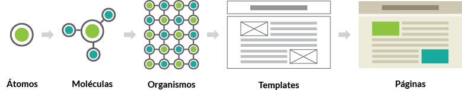

# css-guideline #
A guideline for architecture and naming convetion for CSS

## Objetivo

O objetivo deste repositório é descrever um padrão de desenvolvimento de código `CSS` cujo o processo de estilização fique mais simples e produtivo, mantendo as boas práticas e performance na aplicação.

---

## Design Atômico

O Design Atômico é uma metodologia de desenvolvimento de estilos css onde a estrutura da página ou site é encarada de forma semelhante ao conceito químico de átomos e moléculas. Ou seja, componentes menores como botões por exemplo, são vistos como átomos dentro da página, enquanto items maiores como o rodapé do site, são tratados como organismos.

Dessa forma os elementos mais complexos (páginas) são compostos por unidades menores, (templates) até chegarmos nas menores partes da hierarquia (átomos).

<p style="background-color: #fff; padding: 25px;"></p>

### **Átomos**
Átomos são as menores partes dentro da estrutura da página. São elementos que devem ser o mais abstratos possíveis, para que posssam se adequar a praticamante qualquer parte do cóodigo em que forem utilizados. Botões, links e logos por exemplo, geralmente tem esse comportamento.

**Exemplo**

> HTML
```
<a class="a-link">Link</a>
```

> CSS
```
a-link {
  color: #f00;
  text-align: center;
  font-size: 12px;
  border: 1px solid #f00;
}
```


### **Moléculas**
Moléculas são o segundo nível da hierarquia de elementos. As moléculas são basicamente a união de átomos dando alguma função e estrutura a eles. Exemplos de moléculas podem ser os menus e listas.

**Exemplo**

> HTML
```
<ul class="m-list">
  <li class="m-list-item">
    <a class="a-link">Item 1</a>
  </li>
  <li class="m-list-item">
    <a class="a-link">Item 2</a>
  </li>
</ul>
```

> CSS
```
m-list {
  margin-left: auto;
  margin-right: auto;
  max-width: 1200px;
}

m-list-item {
  padding: 10px;
}
```

### **Organismos**
Os Organismos assim como as moléculas são compostos por suas partes menores (átomos e moléculas). Esses elementos de forma geral já são capazes de trazer uma informação ou funcionaidade completa. Alguns exemplos são o rodapé, cabeçalho e artigos;

**Exemplo**

> HTML
```
<footer class="o-footer">
  <ul class="m-list">
    <li class="m-list-item">
      <a class="a-link">Item 1</a>
    </li>
    <li class="m-list-item">
      <a class="a-link">Item 2</a>
    </li>
  </ul>
  <ul class="m-list">
    <li class="m-list-item">
      <a class="a-link">Item 3</a>
    </li>
    <li class="m-list-item">
      <a class="a-link">Item 4</a>
    </li>
  </ul>
</footer>
```

> CSS
```
o-footer {
  width: 100%;
  background-color: #000;
  position: relative;
}
```

### **Templates**
Os templates são componentes que estilizam características gerais, de maneria que as estruturas das páginas possam ser reaproveitadas, ou seja, uma espécie de "esqueleto" do layout.

**Exemplo**

> HTML
```
<main class="t-brand">
  /* Conteúdo */
</main>
```

> CSS
```
t-brand {
  width: 100%;
  min-height: 950px;
  position: relative;
  background-color: #fff;
}
```

### **Páginas**
As páginas são o último nível da hierarquia. Nelas temos estilos que abrangem comportamentos específicos de um determinado layout, uma vez que os demais estilos já foram determinados pelas suas outras partes.

**Exemplo**

> HTML
```
<body class="p-main-brand">
  /* Conteúdo */
</body>
```

> CSS
```
p-main-brand {
  background-color: #00f;
}
```

### **Escopos de componetes**
lorem ipsum

**Exemplo**
```
p-about {
  background-color: #00f;
}
```

---

## Nomenclatura de classes

### **Prefixos**
lorem ipsum

**Exemplo**
```
p-about {
  background-color: #00f;
}
```

### **Abreviações**
lorem ipsum

**Exemplo**
```
p-about {
  background-color: #00f;
}
```

### **Modificadores**
lorem ipsum

**Exemplo**
```
p-about {
  background-color: #00f;
}
```
---

## Boas práticas
lorem ipsum

**Exemplo**
```
p-about {
  background-color: #00f;
}
```

